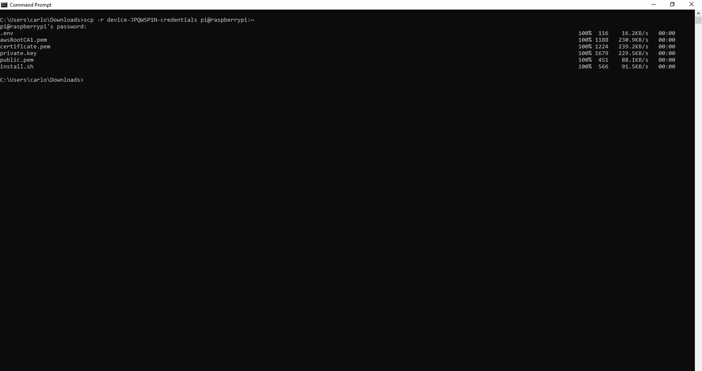

In this section we will show the very first steps to build your IoT Instathings world! 

In order to manage all your sensors and devices you will need a gateway with an Internet connection. You can choose a Raspberry Pi (which we used for this tutorial) or any device that is able to install Docker. 

If you have any question about choosing a gateway feel free to contact us on our site! 

## Software Requirements 
Install Docker 🐳 on your gateway executing the following commands in the command line one by one. <br> They are suitable for Linux, if you have other operating systems please refer to <a href="https://docs.docker.com/install/" class="external-link">Docker documentation</a>.
 

```
curl -sSL https://get.docker.com | sh

sudo usermod -aG docker pi
```

## Gateway onboarding
Your gateway is now ready to be connected to the Instathings Cloud. <br> Log in to Instathings Editor and start by creating a new project on the `Projects` page. Give your project a name and choose a `live` environment. For more information about `Sandbox` and `Live` environments refer to the  <a href="/docs/projects.html" class="external-link">project documentation section</a>.


As you can see once created the light is yellow: it means that the device isn't connected.


## Let's generate the certificate
The Certificate will generated along the procedure for onboarding the Gateway. So proceed with following steps.


Click on `Generate and download certificate` and the download will automatically begin.
Search for the zip file in your download folder.


Then you will have to expand the folder contained in the zip file (with command `Extract to a specific folder`) and move it to your gateway in the way you prefer: using Drag&drop if you have previously installed Samba on your Raspberry, as explained [here](https://pimylifeup.com/raspberry-pi-samba/).

Or with this command with the Terminal.


```
scp -r device-JPQW5P1N-credentials pi@raspberrypi:~
```
If you want to use the command, be sure to customize it with your information.

The Raspberry Password will be asked to execute command.
You'll obtain a situation like this


Slight differences could be due to Operating System on your PC which are installing from.
We are using scp. If you need any help with it please contact us through the chat in the left-bottom corner of the webpage.

Let's continue with the procedure.


Once executed the command you'll have a situation like this.


Now we move inside the device with an SSH Terminal.


Install it with the following command:
```
ls -la

sudo chmod 777 -R device-JPQW5P1N-credentials/

cd device-JPQW5P1N-credentials/

ls -la

./install.sh

```

## Conclusion

Let's go back to our webpage.

And refresh it  with this button.


And the light should turn to green.
Meaning that the gateway is correctly connected to Instathings.


