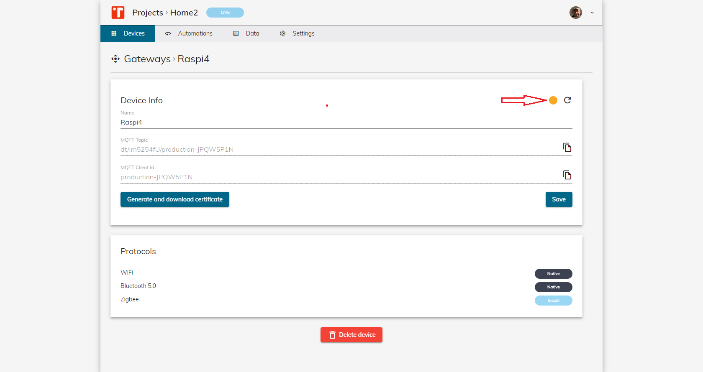

Here follows the procedure for using a normal Raspberry Pi as a Gateway of our Instathings system.

Please check Requirements for having an idea of what is requested. 

Assuming the Raspberry Pi already installed and updated properly. 
In this case go directly to point 2), on the contrary please refer to point 1).

Requirements:
1. Operating System (latest stable version) updated and configured properly
2. Docker


## Operating System
Install the Operating System on your Raspberry Pi 3+ or higher (preferred 4), accordingly to your needs. We suggest the smaller O.S. version without the Graphical User Interface (Raspbian Buster Lite).


Please refer to official site for taking the latest version [Raspbian](https://www.raspberrypi.org/downloads/raspbian/)

And more in general refer to [Installation](https://www.raspberrypi.org/documentation/installation/)

## Docker
Install Docker following these simple steps, as described in [here](https://dev.to/rohansawant/installing-docker-and-docker-compose-on-the-raspberry-pi-in-5-simple-steps-3mgl)


Install Docker
```
curl -sSL https://get.docker.com | sh
```


Add permission to Pi User to run Docker Commands

```
sudo usermod -aG docker pi
```


Test Docker installation

```
docker run hello-world 
```

Install proper dependencies 
```
sudo apt-get install libffi-dev libssl-dev

sudo apt-get install -y python python-pip

sudo apt-get remove python-configparser
```


## How to onboard your gateway on Instathings

Click on `Projects` and then the button `New project` on the right side.


Give it a Name.

And select `Live` (on `Environment`), because we want to work with real-existing devices.

Now we can proceed with the creation of the gateway in our Project. Click on `Create a new gateway`.


Give it a name
And select the type of device for your gateway (e.g.: `Raspberry - Raspberry - Pi 4 Model B`).
Click on `Create device`.




As you can see once created the light is yellow: it means that the device isn't connected.

## Let's generate the certificate
The Certificate will generated along the procedure for onboarding the Gateway. So proceed with following steps.


Click on `Generate and download certificate` and the download will automatically begin.
Search for the zip file in your download folder.


Then you will have to expand the folder contained in the zip file (with command `Extract to a specific folder`) and move it to your gateway in the way you prefer: using Drag&drop if you have previously installed Samba on your Raspberry, as explained [here](https://pimylifeup.com/raspberry-pi-samba/).

Or with this command with the Terminal.


```
scp -r device-JPQW5P1N-credentials pi@raspberrypi:~
```
If you want to use the command, be sure to customize it with your information.

The Raspberry Password will be asked to execute command.
You'll obtain a situation like this


Slight differences could be due to Operating System on your PC which are installing from.
We are using scp. If you need any help with it please contact us through the chat in the left-bottom corner of the webpage.

Let's continue with the procedure.


Once executed the command you'll have a situation like this.


Now we move inside the device with an SSH Terminal.


Install it with the following command:
```
ls -la

sudo chmod 777 -R device-JPQW5P1N-credentials/

cd device-JPQW5P1N-credentials/

ls -la

./install.sh

```

## Conclusion

Let's go back to our webpage.

And refresh it  with this button.


And the light should turn to green.
Meaning that the gateway is correctly connected to Instathings.


