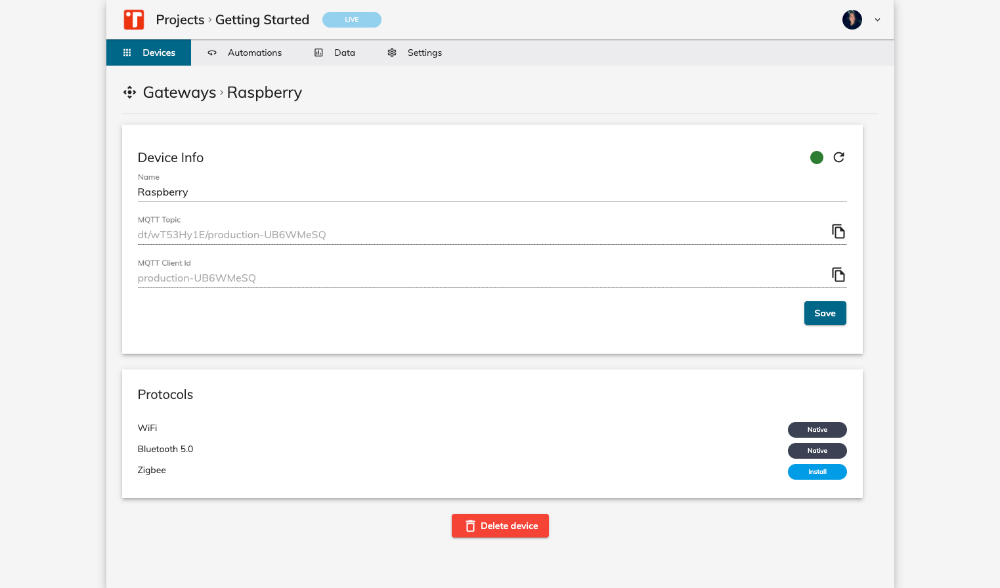
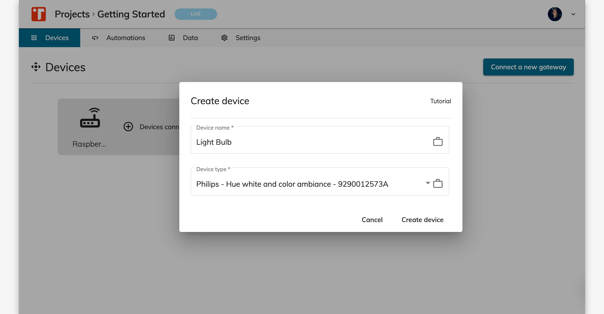
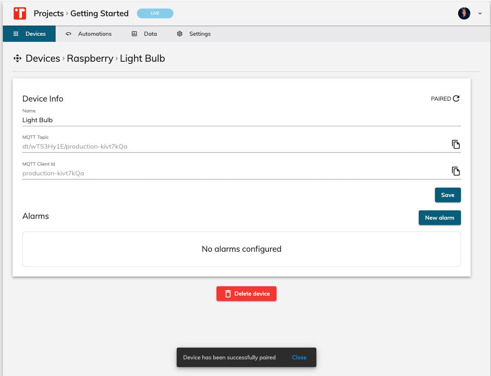
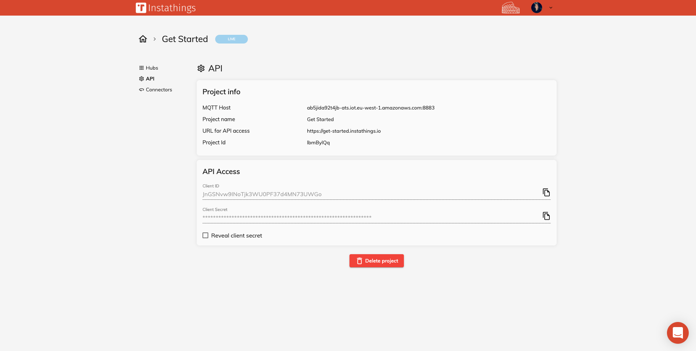

In this tutorial we will show how to connect a Philips Hue bulb and control it with Instathings.

Before starting make sure you have followed the previous tutorials to <a href="/docs/connect-raspberry.html" class="external-link">connect you gateway</a> and to <a href="docs/flashing-dongle.html" class="external-link">configure your Zigbee dongle</a>. Of course you will also need to connect the USB dongle to the gateway device.

## Connect a Philiphs Hue bulb

### Install Zigbee protocol in your gateway
First of all you need to install the zigbee software into your gateway. This can be easily done by our editor: in your gateway page just click on the `install` button of the Zigbee protocol, wait a few seconds and when `installed` appears you can go on to the next step!

<a href="assets/control-bulb/installProtocol.png" target="_blank">
    
</a>

### Create the subdevice
Now go back to the devices page and create a new subdevice. Give it a name and choose the type correctly, in this case we used the model `Philips - Hue white and color ambiance - 9290012573A`

<a href="assets/control-bulb/createSubdevice.png" target="_blank">
    
</a>

### Pair the subdevice with the gateway
Once you create a subdevice you are redirected to its page. Now you have to pair your device to you gateway by clicking on the airplane button on the right side of the page. 

**Be aware!** Before start pairing your Philips Hue bulb turn it on and bring it close to the USB dongle less than 10 cm (~ 3 inch). This will allow the bulb to join the zigbee network managed by the dongle coordinator. 

After a moment you shold see the bulb blinking 3 times and the device has been succesfully paired! This is also confirmed in the editor page.

<a href="assets/control-bulb/pairedSuccess.png" target="_blank">
    
</a>


## Control a Philips Hue bulb

### Enable API access
Before start controlling the bulb you have to enable API access to your devices and obtain the credentials.
Go to `Settings` page and click to `Enable API access`. For more information about API access refer to our
<a href="https://developers.instathings.io/" class="external-link">API documentation</a>. Anyway you don't need to any have technical background to follow this tutorial.

<a href="assets/control-bulb/API.png" target="_blank">
    
</a>

You just need to copy the following informations to use them in the next step. They are all available in the `Settings` page.
 * `Base url for API access`
 * `Client ID`
 * `Client Secret`  

 Now go back to the `Devices` page, selct your Light Bulb subdevice and copy the `device ID`, you will need it in the following step togheter with the settings information. 

### Change bulb state
 Now you are ready to control the bulb! Go to the Light Bulb Demo Application and paste fill the form with the information of your project and your device.
 
 Then set the payload with the parameters you want to control, for example using the following payload the light will turn into blue!
 
 ```javascript
 {
	"state": "ON",
	"color": {
		"x": 0.150,
		"y": 0.005
	},
	"brightness": 255
}
 ```

