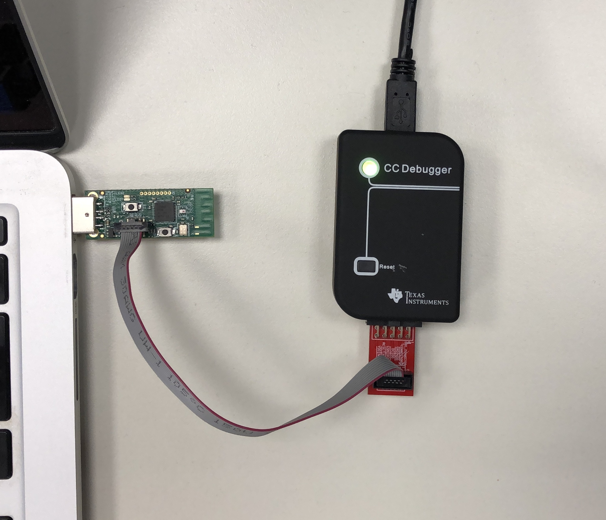

In order to use a Zigbee device you need to configure a network with a so called *coordinator* device which is responsible for creating the network and routing traffic. 

For this purpose we'll use a USB dongle CC2531, designed by Texas Instrument. <br> However before start using it, the dongle needs to be flashed with a new firmware (a software that allows it to act as a network coordinator). 

This tutorial we will show you how to correctly configure the USB dongle for getting it ready for Instathings. 

It will take just 5 minutes, let's start!

## Flash the firmware to the USB dongle

### Hardware requirements
This tutorial is for MacOS systems and you need the following devices:
* CC2531 USB Dongle
* CC Debugger

### Software requirements

First of all you need to install Homebrew on you Mac. Open the terminal and execute the following commands line by line:

```
# install brew
/usr/bin/ruby -e "$(curl -fsSL https://raw.githubusercontent.com/Homebrew/install/master/install)"

# install dependecies
brew install autoconf automake libusb boost pkgconfig libtool

# clone cc-tool
git clone https://github.com/dashesy/cc-tool.git
cd cc-tool
./bootstrap
./configure
make
```

#### Download the firmware

Download the firmware from the <a href="https://github.com/Koenkk/Z-Stack-firmware/raw/master/coordinator/Z-Stack_Home_1.2/bin/default/CC2531_DEFAULT_20190608.zip" target="_blank" class="external-link">following link</a>. This software will be flashed in the dongle. 

### Connect the dongle 
Now you need to connect the dongle to the CC Debugger and then connect the dongle to your pc. The cables connection is shown in the following picture.

Generally the status led on the debugger should be green, if not turn off and on the debbuger. 

<a href="assets/flashing-dongle/CCDebugger.JPG" target="_blank">
    
</a>

### Flash the firmware
Now, from your command line, execute the following command:

```bash
sudo ./cc-tool -e -w CC2531ZNP-Prod.hex`
```

## Check the connection
Now let's move from our Mac to the device that will use with our Instathings system. For this tutorial we're using a Raspberry Pi 4. <br > Connect your USB dongle to your device let's execute the following script to check if it is correctly detected.

```bash
sudo nano cc2531.sh
```

Copy the following script and then save it (to save type `Ctrl+X, Y, Enter`)

```
#!/bin/bash
for sysdevpath in $(find /sys/bus/usb/devices/usb*/ -name dev); do
    (
        syspath="${sysdevpath%/dev}"
        devname="$(udevadm info -q name -p $syspath)"
        [[ "$devname" == "bus/"* ]]
        eval "$(udevadm info -q property --export -p $syspath)"
        [[ -z "$ID_SERIAL" ]]
        echo "/dev/$devname - $ID_SERIAL"
    )
done
```
Now give it the permission and execute it

```bash
sudo chmod +x cc2531.sh 
./cc2531.sh
```
If everything worked fine, you should see something like this:

```bash
/dev/bus/usb/001/001 - Linux_4.19.75-v7l+_xhci-hcd_xHCI_Host_Controller_0000:01:00.0
/dev/ttyACM0 - Texas_Instruments_TI_CC2531_USB_CDC___0X00124B0018E199DF
/dev/bus/usb/001/004 - Texas_Instruments_TI_CC2531_USB_CDC___0X00124B0018E199DF
/dev/bus/usb/001/002 - 2109_USB2.0_Hub
/dev/bus/usb/002/001 - Linux_4.19.75-v7l+_xhci-hcd_xHCI_Host_Controller_0000:01:00.0
/dev/bus/usb/003/001 - Linux_4.19.75-v7l+_dwc_otg_hcd_DWC_OTG_Controller_fe980000.usb
```
As you can see our dongle is correctly detected on `/dev/ttyACM0` and we can now start using our Zigbee network! 

Let's go on with the next steps!
