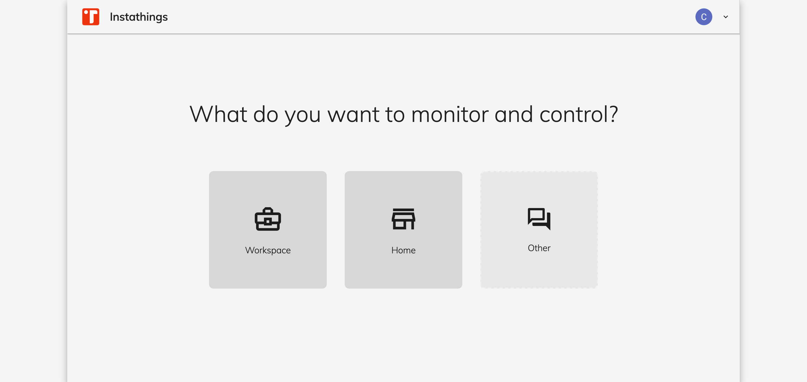

## Your first big choice 

Your first choice in the Editor will be to create a project from scratch or use the Planner. 

Planner helps you to get started quickly by going through a step by step wizard which will ask you the environments and the things you want to monitor.

## Start planning

Planner is the way to go for now, let's click on `Start Planner`.

## Choose the environment

Choose the environment that best represent your use case. 

We currently support `Workspace` and `Home` environments but you can suggest new ones by clicking on `Other`

Let's say that we'd like to monitor a `Workspace` by clicking on it.

## Set up rooms

On this new page you can click on the different rooms to add them to the Plan. 

Each room will have a name and a dimension and you'll have to point what you'd like to monitor. 

For instance let's add:
- two toilets, each with an open/close door sensor 
- an open space, with an air quality sensor an several temperature sensors. 

Note that we're not yet choosing any particular model or manufacturer but rather we're defining our monitoring logic at an higher level.

Let's click on `Create Plan` by giving it a name, your first Plan is now being generated.

## Review your plan

A new plan will be generated and specific sensors will be added to each room based on your needs. 

## Create project

Based on the plan you can now create your first project by clicking on `Create project`. 

After choosing your Project's name you'll be able to start monitoring your project.

Note: as you can see the environment is currently set to `Sandbox`. A `Sandbox` environment will behave like a the real world but you won't need to buy any sensor but you can play with it first.

## Devices

The `Devices` section will give you an overview of all the devices related to a project.

On the left handside you'll find `Gateway` devices while on the right all the connected devices to that gateway will be listed.

In this case our Plan created a Gateway and connected 4 sensors to it. 

Of course since we're in a `Sandbox` environment this is to a logic level only.

## Device detail

In the Device detail page you'll be able to see additional details of the specific sensor.

In this example we'll cover the temperature sensor in the open space room.

### Virtual data

Let's click on `START SENDING DATA` to periodically (1/min) generate a new virtual measurment of the sensors. 

Note that the structure of the data is the same of the real world device so you'll be able to work on those data and for instance start developing your application based on that.

### Alarms

You can configure an `Alarm` in order to get notified by an `Automation` when a device stop sending data due to a failure. 

However let's keep it simple for now, we'll cover this in a diffent tutorial.

## Exploring device data

From the top menu, let's click on the `Data` section, and select our device.

We are now able to see that data is flowing and its being sent every minute.

If we want to get a closer look of the data you can click on the eye icon to check a specific measurement.

## Conclusion

This Get started guide covered the `Project` and the `Device` concept of Instathings but didn't cover some other useful topics like `Automations` and `Alarms`.
